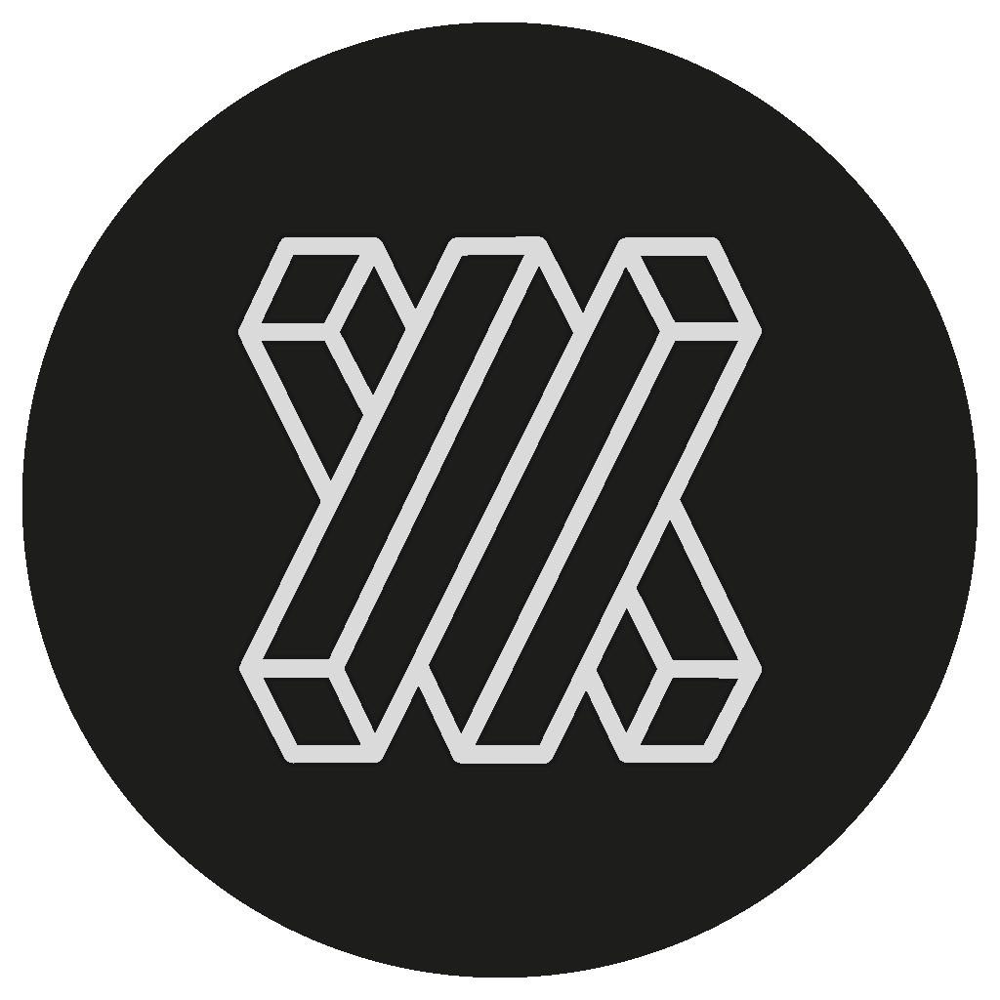

  
  

# Runway + Unity

A collection of stand alone examples connecting [Runway](https://runwayml.com/) to [Unity](https://unity3d.com/).
Examples are separated by current available models.

## Examples

## Contributing

This is still a work in progress. Contributions are welcomed!

