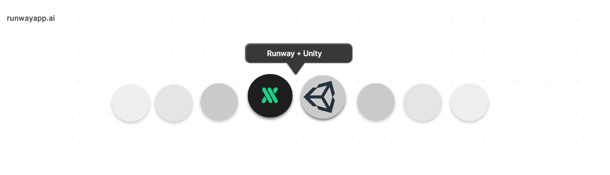

# This project has moved to a new repository [here](https://github.com/runwayml/RunwayML-for-Unity)

  

# Runway + Unity

A collection of examples and tutorials on how to use [Runway](https://runwayml.com/) with [Unity](https://unity3d.com/).

## Examples

### Runway Beta

### Runway Alpha [Not Supported]

- [OpenPose](https://github.com/runwayml/examples_unity/tree/master/openpose): This example has Scenes for [receving values](https://github.com/runwayml/examples_unity/tree/master/openpose/receiveOnly/Assets/Scenes) and [receiving values with webcam feed](https://github.com/runwayml/examples_unity/tree/master/openpose/receiveOnly/Assets/Scenes). Two additional Scenes showcase recording and playback of OpenPose data via the Unity plugin [RecordAndPlay](https://github.com/fx-lange/unity-record-and-play).

## Contributing

This is still a work in progress. Contributions are welcomed!

  ### Contributors
  
  [@fx-lange](https://github.com/fx-lange)
